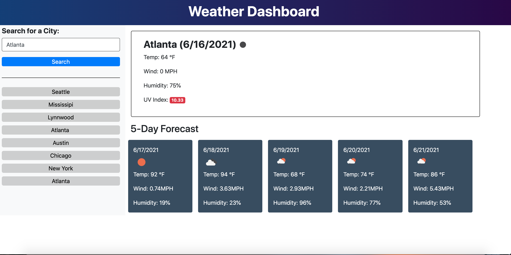

# weather-dashboard
A simple weather dashboard that runs in the browser and features dynamically updated HTML and CSS

# Motivation for this project

learn how to use the OpenWeather One Call API to retrieve weather data for cities and using it to build a weather dashboard that will run in the browser and feature dynamically updated HTML and CSS..

# Reason for this project 

Build a weather dashboard that allows the user to see the weather outlook for multiple cities.

# What I learned from this project 

In this activity I learnt:

* The step by step breaking down method of the acceptance criteria on HW assignment and the importance of commenting especially after the code has been erased and you cannot remember what was on the code line previously.

* The importance of stackoverflow when trying to figure out what the inspect mistake made means/wants you to correct what you need fixed. 

* How to use fetch method to make request data from a server and convert them into HTML elements. 

* How to read documentation when working with server side API's.

https://conso97.github.io/work-day-scheduler/

